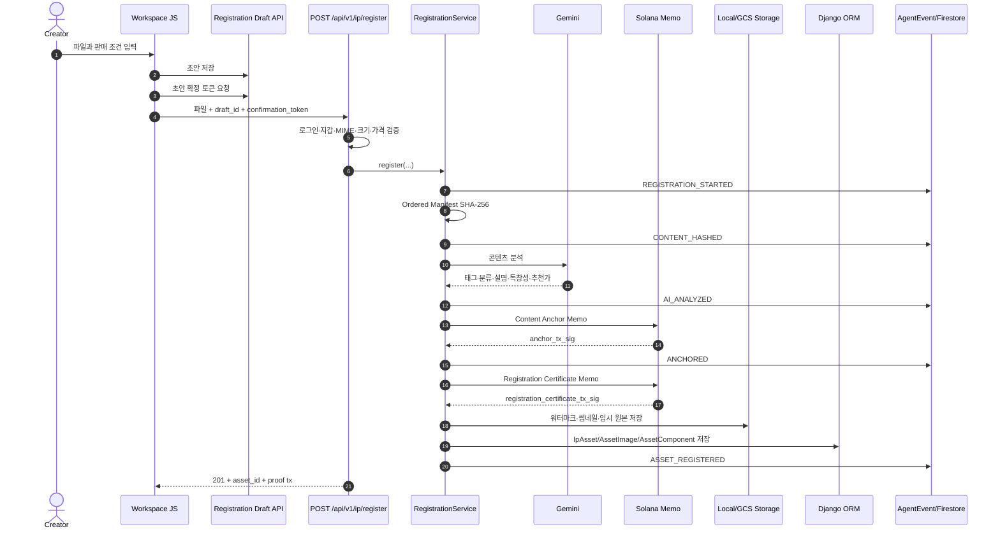
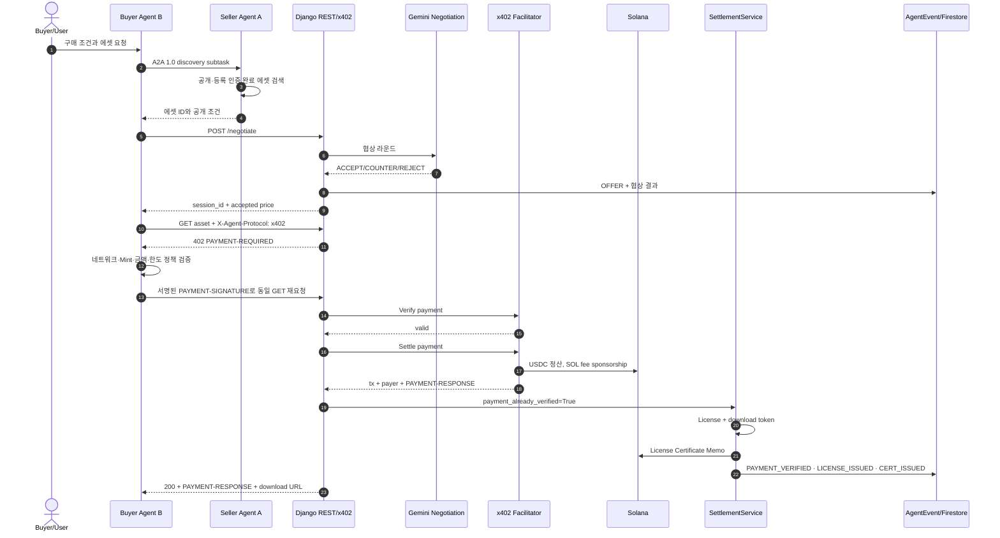

# VeriProof 핵심 시스템 흐름과 담당 코드

> 목적: 현재 저장소의 실제 런타임 코드를 기준으로 **사용자 에셋 등록**과 **Buyer–Seller Agent 거래**가 어떻게 동작하는지 설명한다.  
> 기준일: 2026-08-17  
> 관련 발표 개정안: [Technical Blueprint 개정안](./technical-blueprint-revision-guide.md)

## 0. 먼저 이해해야 할 시스템 경계

VeriProof의 핵심은 한 개의 거대한 에이전트가 모든 일을 처리하는 구조가 아니다. 역할이 다음처럼 분리되어 있다.

| 영역 | 책임 | 런타임 |
|---|---|---|
| Creator Web | 파일 선택, 메타데이터 확인, 등록 확정 | Django Template + Vanilla JS |
| Registration API | 인증, 입력 검증, 등록 유스케이스 호출 | Django |
| Registration Service | 해시, AI 분석, 온체인 앵커, 저장, DB 반영 | Django Service Layer |
| Seller Agent A | 공개 에셋 발견과 라이선스 조건 조회 | ADK + A2A 1.0 |
| Buyer Agent B | Seller Agent 호출, 협상·결제 도구 조정, 정책 집행 | 별도 ADK/ASGI 서비스 |
| Negotiation API | 협상 세션과 라운드 저장, Gemini 결과 검증 | Django REST |
| x402 Payment | USDC 결제 요구, 서명 검증, Facilitator 정산 | Django + x402 V2 SDK |
| Settlement | 라이선스, 인증서, 다운로드 토큰, 감사 데이터 | Django Service Layer |
| Live Demo | 이벤트 SSOT를 Firestore에 복제하고 SSE로 전달 | Django ORM + Firestore + ASGI SSE |

현재 거래 구조는 다음과 같은 **하이브리드 A2A 구조**다.

```text
A2A 1.0              : Agent Card 조회, Seller Agent 호출, 공개 에셋 발견
Django REST          : 가격 협상
x402 V2 over HTTP    : USDC 결제 요구, 결제 서명, 검증, 정산
Settlement Service   : 라이선스·온체인 인증서·다운로드 권한 발급
```

따라서 현재 구현을 “A2A 메시지 하나로 탐색부터 정산까지 모두 수행한다”고 설명하면 정확하지 않다. Buyer Agent가 전체 과정을 조정하지만, 단계별 실행 프로토콜은 A2A와 REST/x402로 나뉜다.

---

## 1. 사용자의 에셋 등록 과정

### 1.1 전체 흐름



### 1.2 1단계 — 사용자가 등록을 확정한다

담당 파일:

- UI: [`veriproof/templates/workspace.html`](../veriproof/templates/workspace.html)
- 클라이언트 흐름: [`veriproof/static/js/workspace.js`](../veriproof/static/js/workspace.js)
- 초안 API: [`veriproof/apps/ip/views_assistant.py`](../veriproof/apps/ip/views_assistant.py)
- 초안 검증 서비스: [`veriproof/services/registration_draft_service.py`](../veriproof/services/registration_draft_service.py)

사용자는 등록 Canvas에서 파일, 제목, 설명, 태그, 최소가, 목표가, 공개 여부를 입력한다. 현재 화면과 API의 판매 가격 단위는 **SOL**이다.

`confirmAndRegister()`는 바로 최종 등록 API를 호출하지 않는다. 먼저 초안을 저장하고, 서버가 확정 토큰을 발급한 후 최종 파일 업로드를 수행한다.

```javascript
// veriproof/static/js/workspace.js:332-366
function confirmAndRegister() {
    saveDraft(creatorWallet).then(function () {
        return request(
            "/api/v1/assistant/registration-drafts/" + profile.draft.draft_id + "/confirm",
            { method: "POST", body: JSON.stringify({ creator_wallet: creatorWallet }) }
        ).then(function (confirmed) {
            uploadConfirmed(confirmed.body.confirmation_token, profile.draft.draft_id, creatorWallet);
        });
    });
}

function uploadConfirmed(token, draftId, creatorWallet) {
    var data = new FormData();
    data.append("image", state.file);
    data.append("draft_id", draftId);
    data.append("confirmation_token", token);
    request(shell.dataset.registerUrl, { method: "POST", body: data });
}
```

패키지 모드에서는 첫 파일이 Primary가 된다. 이미지 작품의 나머지 파일은 `gallery_images`, 비이미지 보조 파일은 `supporting_files`로 전송된다.

### 1.3 2단계 — 등록 API가 인증과 입력을 검증한다

담당 파일:

- URL: [`veriproof/apps/ip/urls.py`](../veriproof/apps/ip/urls.py)
- View: [`veriproof/apps/ip/views_api.py`](../veriproof/apps/ip/views_api.py)
- 사용자 지갑 서명자: [`veriproof/apps/accounts/services.py`](../veriproof/apps/accounts/services.py)

진입점은 `POST /api/v1/ip/register`다.

```python
# veriproof/apps/ip/views_api.py:68-120
def register(request: HttpRequest) -> JsonResponse:
    if request.method != "POST":
        return _error("method_not_allowed", "POST required", status=405)
    if not request.user.is_authenticated:
        return _error("authentication_required", "sign in to register an IP asset", status=401)

    upload = request.FILES.get("image")
    creator_wallet, signer_secret_key = active_wallet_signer(request.user)
    metadata, error = _registration_metadata(request, upload, creator_wallet=creator_wallet)
    ...
    outcome = get_registration_service().register(
        upload,
        metadata,
        supporting_uploads,
        gallery_uploads=gallery_uploads,
        account_owner=request.user,
        signer_secret_key=signer_secret_key,
    )
```

이 경계에서 검증하는 항목은 다음과 같다.

- 로그인 여부
- 계정에 연결된 활성 Solana 지갑과 서명 가능 여부
- Primary 파일 존재 여부
- 에셋 유형별 허용 MIME
- 파일 크기 제한
- Gallery 개수와 이미지 MIME
- 최소가와 목표가의 관계
- SOL의 최대 소수점 9자리
- 확정 초안의 토큰과 업로드 파일 일치 여부

클라이언트가 전달한 `creator_wallet`을 그대로 신뢰하지 않고 `active_wallet_signer(request.user)`가 반환한 계정 지갑을 사용한다.

### 1.4 3단계 — 하나의 작품 지문을 만든다

담당 파일:

- 등록 오케스트레이션: [`veriproof/services/registration_service.py`](../veriproof/services/registration_service.py)
- 해시 계산: [`veriproof/services/image_fingerprint.py`](../veriproof/services/image_fingerprint.py)

Primary와 Gallery 이미지가 여러 장이면 각 파일의 SHA-256을 업로드 순서대로 결합한 뒤 다시 SHA-256을 계산한다. 한 장이면 해당 파일의 SHA-256 자체가 작품 해시다.

```python
# veriproof/services/image_fingerprint.py:91-104
def content_manifest_sha256(self, contents) -> str:
    content_hashes = [self.sha256(content) for content in contents]
    return self.manifest_sha256(content_hashes)

@staticmethod
def manifest_sha256(file_hashes) -> str:
    hashes = tuple(file_hashes)
    if len(hashes) == 1:
        return hashes[0]
    return hashlib.sha256("\n".join(hashes).encode("ascii")).hexdigest()
```

중요한 범위:

- `Primary + gallery_images`는 하나의 Ordered Manifest Hash에 포함된다.
- `supporting_files`는 개별 SHA-256을 `AssetComponent`에 저장하지만 현재 작품의 대표 Manifest Hash에는 포함되지 않는다.
- 대표 Manifest Hash는 `IpAsset.image_sha256`에 유일값으로 저장되므로 동일 작품 해시의 중복 등록을 거부한다.
- 이미지 작품은 별도로 perceptual hash를 생성해 유사 이미지 검색 후보에 사용한다.

### 1.5 4단계 — Gemini가 에셋을 분석한다

담당 파일:

- 호출부: [`veriproof/services/registration_service.py`](../veriproof/services/registration_service.py)
- Gemini 어댑터: [`veriproof/services/gemini_service.py`](../veriproof/services/gemini_service.py)
- 결과 타입: [`veriproof/services/_types.py`](../veriproof/services/_types.py)

분석 가능한 이미지, PDF, 텍스트, 오디오, 비디오는 Gemini에 전달된다. 결과는 구조화 스키마를 통해 다음 필드로 받는다.

```text
tags
category
originality_score
recommended_min_price_usdc
description
```

사용자가 입력한 `tags`, `description`과 AI가 생성한 `ai_tags`, `ai_description`은 DB에서 분리 보존된다. 공개 검색에서는 두 필드군을 함께 사용한다.

ZIP/TAR처럼 저장할 수 있지만 LLM이 직접 분석하지 않는 파일은 AI 결과를 꾸며내지 않고 비운 채 사용자 메타데이터만 유지한다. 분석 대상 파일에서 Gemini 호출이 실패하면 임의 분석값으로 fallback하지 않고 등록을 `503 analysis_unavailable`로 종료한다.

### 1.6 5단계 — Solana에 두 종류의 Memo를 기록한다

담당 파일:

- Solana 어댑터: [`veriproof/services/solana_service.py`](../veriproof/services/solana_service.py)
- 어댑터 선택: [`veriproof/services/solana_adapter_factory.py`](../veriproof/services/solana_adapter_factory.py)
- 지갑/KMS 서명: [`veriproof/services/kms_signer.py`](../veriproof/services/kms_signer.py)

등록 중 서로 목적이 다른 두 개의 온체인 기록이 생성된다.

```python
# veriproof/services/solana_service.py:40-82
memo = f"veriproof:anchor:{image_sha256.lower()}:{creator_pubkey}"
anchor_tx_sig = self.submit_memo(memo, sender_secret_key)

memo = (
    f"veriproof:registration:{asset_id}:{creator_pubkey}:"
    f"{content_sha256.lower()}"
)
registration_certificate_tx_sig = self.submit_memo(memo, sender_secret_key)
```

| 기록 | 목적 | 포함 정보 |
|---|---|---|
| Content Anchor | 작품 바이트의 무결성과 Creator Wallet 연결 | Manifest SHA-256, Creator Wallet |
| Registration Certificate | 특정 Asset UUID의 등록 사실 연결 | Asset ID, Creator Wallet, Manifest SHA-256 |

원본 파일은 온체인에 올라가지 않는다. 온체인 Memo에는 검증에 필요한 해시와 식별자만 기록한다.

### 1.7 6단계 — 파일과 DB 레코드를 저장한다

담당 파일:

- 저장소: [`veriproof/services/storage_service.py`](../veriproof/services/storage_service.py)
- 모델: [`veriproof/apps/ip/models.py`](../veriproof/apps/ip/models.py)
- 등록 트랜잭션: [`veriproof/services/registration_service.py`](../veriproof/services/registration_service.py)

저장 정책은 다음과 같다.

| 데이터 | 저장 방식 |
|---|---|
| Thumbnail | 영구 저장 |
| Watermark preview | 영구 저장 |
| Supporting file | 영구 저장, 개별 해시 보존 |
| Original | `ORIGINAL_RETENTION_DAYS`에 따른 임시 저장 |
| Gallery original | 임시 저장 |
| 메타데이터·해시·Tx signature | 관계형 DB 영구 저장 |

`IpAsset`에는 Creator, 계정 소유자, 메타데이터, AI 메타데이터, 가격, 작품 해시, 미리보기 위치, 원본 만료, Anchor Tx, Registration Certificate Tx가 저장된다. 추가 이미지는 `AssetImage`, 보조 파일은 `AssetComponent`가 담당한다.

DB 레코드는 `transaction.atomic()` 안에서 생성된다. 다만 AI 호출, Solana 전송, Storage 저장은 DB 트랜잭션보다 먼저 실행되는 외부 부작용이다. 따라서 후반 DB 저장이 실패하면 이미 생성된 온체인 트랜잭션을 되돌릴 수 없으며, 별도 재처리·정리 정책이 필요하다.

### 1.8 등록 이벤트와 Live Demo

담당 파일:

- 이벤트 저장·Fan-out: [`veriproof/services/event_recorder.py`](../veriproof/services/event_recorder.py)
- 이벤트 모델: [`veriproof/apps/common/models.py`](../veriproof/apps/common/models.py)
- Firestore 복제: [`veriproof/services/firestore_mirror.py`](../veriproof/services/firestore_mirror.py)
- 인증 SSE: [`veriproof/apps/common/views_live_demo.py`](../veriproof/apps/common/views_live_demo.py)

정상 등록 이벤트 순서는 다음과 같다.

```text
REGISTRATION_STARTED
→ CONTENT_HASHED
→ AI_ANALYZED
→ ANCHORING_STARTED
→ ANCHORED
→ REGISTRATION_CERTIFICATE_ISSUED
→ ASSET_REGISTERED
```

등록 중에는 아직 `IpAsset` 레코드가 없으므로 미리 생성한 `asset_id`를 `correlation_id`로 사용한다. DB 저장이 끝나면 같은 `correlation_id`의 초기 이벤트에 실제 Asset FK를 연결한다.

```python
# veriproof/services/registration_service.py:100-110, 281-294
asset_id = uuid.uuid4()
event_context = {
    "account_owner": account_owner,
    "asset_id": asset_id,
    "correlation_id": asset_id,
}
event_recorder.record("REGISTRATION_STARTED", ..., **event_context)

AgentEvent.objects.filter(
    correlation_id=asset_id,
    asset__isnull=True,
).update(asset=asset)
event_recorder.record("ASSET_REGISTERED", ..., asset=asset, correlation_id=asset_id)
```

`AgentEvent` 관계형 DB가 이벤트 SSOT다. EventRecorder는 같은 이벤트를 Firestore와 BigQuery로 fan-out한다. Firestore나 BigQuery 복제 실패는 핵심 등록을 중단시키지 않으며 DB 이벤트는 유지된다.

---

## 2. A2A 거래 과정

### 2.1 전체 흐름

아래는 발표 목표인 **고정 Gasless USDC 경로**를 기준으로 하되, 실제 코드의 프로토콜 경계를 그대로 표현한 흐름이다.



### 2.2 1단계 — Seller Agent A가 A2A 엔드포인트로 공개된다

담당 파일:

- ASGI 결합: [`veriproof/config/asgi.py`](../veriproof/config/asgi.py)
- Agent Card와 A2A Mount: [`veriproof/agent_a/application.py`](../veriproof/agent_a/application.py)
- Seller Agent 정의: [`veriproof/agent_a/agent.py`](../veriproof/agent_a/agent.py)
- Seller 읽기 도구: [`veriproof/agent_a/tools.py`](../veriproof/agent_a/tools.py)

Django ASGI 애플리케이션과 ADK A2A 애플리케이션을 하나의 Starlette 루트에 마운트한다.

```python
# veriproof/agent_a/application.py:47-64
agent_card = build_agent_card()
a2a_application = to_a2a(root_agent, agent_card=agent_card)

return Starlette(routes=[
    *create_agent_card_routes(agent_card),
    Mount("/a2a", app=a2a_application),
    Mount("/", app=django_application),
])
```

공개 인터페이스는 JSON-RPC 기반 A2A 1.0이며 streaming capability를 선언한다. Seller Agent가 가진 실제 도구는 다음 두 개의 읽기 전용 도구다.

- `search_licensable_assets`: 공개 카탈로그 검색
- `get_licensable_asset`: Asset UUID로 상세 조회

검색 결과에는 워터마크 미리보기만 포함되며 원본 URL은 노출되지 않는다. 또한 `visibility=public`, `status=anchored/listed`, `registration_certificate_tx_sig IS NOT NULL`인 자산만 반환한다.

### 2.3 2단계 — Buyer Agent B가 Seller Agent를 원격 도구로 사용한다

담당 파일:

- Buyer Agent: [`agents/buyer_agent/agent.py`](../agents/buyer_agent/agent.py)
- Remote A2A 연결: [`agents/buyer_agent/tools.py`](../agents/buyer_agent/tools.py)
- Buyer ASGI 앱: [`agents/buyer_agent/app.py`](../agents/buyer_agent/app.py)

```python
# agents/buyer_agent/tools.py:381-390
def build_seller_agent() -> RemoteA2aAgent:
    return RemoteA2aAgent(
        name="veriproof_seller_agent",
        description="Remote VeriProof seller ...",
        agent_card=get_seller_agent_card_url(),
    )
```

Buyer Agent는 Seller Agent에 구매·결제·원본 전달 전체를 넘기지 않는다. Seller Agent는 발견 하위 작업만 수행하고, Buyer Agent가 반환된 Asset ID를 가지고 이후 REST 협상과 결제 도구를 직접 호출한다.

이 설계의 장점은 다음과 같다.

- Seller Agent의 권한을 공개 카탈로그 읽기로 제한한다.
- 결제 개인키가 Seller Agent나 LLM 대화에 노출되지 않는다.
- 결제 정책과 사용자 승인 상태를 Buyer Agent 세션에 유지한다.
- A2A 장애를 빈 검색 결과로 오인하지 않고 `seller_agent_unavailable`로 구분한다.

### 2.4 3단계 — 협상 세션을 생성하고 Gemini 결과를 검증한다

담당 파일:

- URL/View: [`veriproof/apps/negotiation/urls.py`](../veriproof/apps/negotiation/urls.py), [`veriproof/apps/negotiation/views_api.py`](../veriproof/apps/negotiation/views_api.py)
- 세션 모델: [`veriproof/apps/negotiation/models.py`](../veriproof/apps/negotiation/models.py)
- 협상 엔진: [`veriproof/services/negotiation_engine.py`](../veriproof/services/negotiation_engine.py)
- Gemini 구조화 응답: [`veriproof/services/gemini_service.py`](../veriproof/services/gemini_service.py)

Buyer Tool은 다음 요청을 보낸다.

```python
# agents/buyer_agent/tools.py:213-240
response = await client.post(
    _asset_url(asset_id, "/negotiate"),
    headers={"X-Agent-Protocol": "x402"},
    json={
        "buyer_agent_id": buyer_agent_id,
        "offer_sol": offer_sol,
        "usage_type": usage_type,
    },
)
```

서버는 `(asset, buyer_agent_id)` 조합으로 `NegotiationSession`을 생성하거나 재사용한다. 각 라운드는 JSON으로 누적되며 결과는 `ACCEPT`, `COUNTER_OFFER`, `REJECT` 중 하나다.

Gemini가 가격을 결정하더라도 서버가 다음 불변식을 다시 강제한다.

- 최대 협상 라운드 수
- Creator 최소 가격 미만으로 ACCEPT/COUNTER 불가
- 허용된 `usage_type`만 사용
- ACCEPT일 때만 수취 지갑 확정
- 금액을 lamport 정밀도인 소수점 9자리로 정규화
- Gemini 호출 실패 시 가격을 추정하지 않고 503 반환

협상 이벤트는 구매자의 `OFFER`와 Seller 결과인 `COUNTER`, `ACCEPT`, `REJECT`를 분리 기록한다.

### 2.5 4단계 — Buyer가 x402 결제 조건을 받는다

담당 파일:

- 리소스 View: [`veriproof/apps/ip/views_api.py`](../veriproof/apps/ip/views_api.py)
- x402 도메인 매핑: [`veriproof/services/x402_service.py`](../veriproof/services/x402_service.py)
- 공식 x402 프로토콜: [`veriproof/services/x402_protocol_service.py`](../veriproof/services/x402_protocol_service.py)
- Buyer 조회 도구: [`agents/buyer_agent/tools.py`](../agents/buyer_agent/tools.py)

Buyer가 `GET /api/v1/ip/{asset_id}`를 `X-Agent-Protocol: x402`로 호출하면, 유효한 라이선스가 없는 경우 서버는 HTTP 402와 `PAYMENT-REQUIRED` 헤더를 반환한다.

```python
# veriproof/apps/ip/views_api.py:477-495
payment_signature = request.headers.get("PAYMENT-SIGNATURE")
if payment_signature:
    return _settle_x402_request(...)
return _payment_required_response(
    request,
    asset,
    x402,
    amount_usdc=amount,
    session=session,
)
```

결제 요구에는 다음 값이 들어간다.

- x402 version 2
- `exact` scheme
- Solana Devnet CAIP-2 network
- USDC Mint
- USDC 최소 단위 금액
- Creator 또는 Escrow 수취 주소
- Facilitator가 제공하는 Fee Payer
- Asset을 식별하는 Memo
- 최대 결제 유효 시간

이 시점에 `ASSET_DISCOVERED`, `HTTP_402` 이벤트가 기록된다.

### 2.6 5단계 — Buyer 정책을 통과한 경우에만 결제한다

담당 파일:

- 승인 Gate: [`agents/buyer_agent/payment_approval.py`](../agents/buyer_agent/payment_approval.py)
- 자율 결제 정책: [`agents/buyer_agent/payments/policy.py`](../agents/buyer_agent/payments/policy.py)
- x402 Buyer: [`agents/buyer_agent/payments/client.py`](../agents/buyer_agent/payments/client.py)
- KMS Buyer signer 선택지: [`agents/buyer_agent/payments/kms_signer.py`](../agents/buyer_agent/payments/kms_signer.py)

`purchase_x402_asset()`는 먼저 사용자 승인 Gate를 확인하고 `AutonomousX402Buyer`를 호출한다. Buyer 개인키는 환경 설정에서 결제 서비스가 직접 읽으므로 LLM의 인자나 응답에 포함되지 않는다.

```python
# agents/buyer_agent/payments/policy.py:88-115
if not self.enabled:
    raise PaymentPolicyRejected(...)
if version != 2:
    raise PaymentPolicyRejected(...)

if (
    requirement.scheme == "exact"
    and str(requirement.network) == self.network
    and requirement.asset == self.asset
    and 0 < amount <= self.max_atomic_amount
):
    return requirement
```

정책은 다음을 고정한다.

- 자율 결제 활성화 여부
- 허용 네트워크
- 허용 USDC Mint
- 거래당 최대 USDC 금액
- 사용자 승인 필요 여부

공식 `x402HttpxClient`는 최초 402 응답을 읽고, Buyer가 서명한 `PAYMENT-SIGNATURE`를 포함해 동일 GET을 자동 재요청한다.

### 2.7 6단계 — Facilitator가 Verify 후 Settle한다

담당 파일:

- 서버 결제 처리: [`veriproof/services/x402_protocol_service.py`](../veriproof/services/x402_protocol_service.py)
- Django 결제 재요청 처리: [`veriproof/apps/ip/views_api.py`](../veriproof/apps/ip/views_api.py)

```python
# veriproof/services/x402_protocol_service.py:136-169
requirements = self.server.find_matching_requirements(
    challenge.payment_required.accepts,
    payload,
)
verification = self.server.verify_payment(payload, requirements)
if not verification.is_valid:
    raise X402PaymentInvalid(...)

settlement = self.server.settle_payment(payload, requirements)
if not settlement.success:
    raise X402PaymentInvalid(...)
```

순서는 반드시 다음과 같다.

```text
PAYMENT-SIGNATURE decode
→ 현재 결제 요구와 일치 여부 확인
→ Facilitator Verify
→ Facilitator Settle
→ transaction + payer + PAYMENT-RESPONSE
```

Gasless에서 Buyer는 USDC 지불을 승인하고, Facilitator가 제공한 Fee Payer가 Solana 네트워크 수수료를 SOL로 부담한다. “수수료가 없다”가 아니라 “Buyer가 SOL을 준비하지 않아도 된다”는 의미다.

### 2.8 7단계 — 라이선스와 인증서를 발급한다

담당 파일:

- 정산 오케스트레이션: [`veriproof/apps/settlement/services.py`](../veriproof/apps/settlement/services.py)
- 라이선스: [`veriproof/services/license_service.py`](../veriproof/services/license_service.py)
- License 모델: [`veriproof/apps/settlement/models.py`](../veriproof/apps/settlement/models.py)
- Solana 인증서: [`veriproof/services/solana_service.py`](../veriproof/services/solana_service.py)

x402 Facilitator가 이미 결제를 검증하고 정산했으므로 `_settle_x402_request()`는 `payment_already_verified=True`로 공통 정산 파이프라인을 호출한다.

```python
# veriproof/apps/ip/views_api.py:876-884
result = get_settlement_service().settle_pipeline(
    asset=asset,
    session=session,
    tx_signature=settled.transaction,
    buyer_wallet=settled.payer,
    expected_amount=amount_usdc,
    usage_type=session.usage_type if session else "commercial",
    payment_already_verified=True,
)
```

공통 정산 파이프라인은 다음 순서를 가진다.

```text
License.grant
→ PAYMENT_VERIFIED
→ LICENSE_ISSUED
→ Solana License Certificate Memo
→ Firestore asset_status=LICENSED
→ BigQuery transaction audit
→ CERT_ISSUED
→ 만료 Download Token 반환
```

`License.payment_tx_sig`는 UNIQUE이므로 동일 결제 트랜잭션이 재제출돼도 기존 License를 반환한다. 다운로드 권한은 영구 URL이 아니라 만료 시간이 있는 토큰으로 저장한다.

라이선스 인증서 Memo는 다음 형태다.

```text
veriproof:license:{asset_id}:{buyer_wallet}:{license_memo_digest}
```

온체인에는 다운로드 URL, 원본 바이트, 다운로드 토큰을 기록하지 않는다.

### 2.9 거래 이벤트와 correlation_id

정상적인 거래 이벤트는 다음 순서로 관측된다.

```text
ASSET_DISCOVERED
→ HTTP_402
→ OFFER
→ COUNTER 또는 ACCEPT
→ PAYMENT_SUBMITTED
→ PAYMENT_VERIFIED
→ LICENSE_ISSUED
→ CERT_ISSUED
```

`correlation_id_for()`는 에셋과 `buyer_agent_id`를 결합해 안정적인 UUID를 만든다.

```python
# veriproof/services/event_recorder.py:96-105
if buyer_id:
    return uuid.uuid5(
        uuid.NAMESPACE_URL,
        f"veriproof:a2a:{asset_id}:{buyer_id}",
    )
```

이 키를 사용하면 동일 에셋에 여러 Buyer Agent가 접근해도 각각의 협상·결제 흐름을 별도 그룹으로 시각화할 수 있다.

Browser는 Firestore에 직접 접근하지 않는다. 인증된 Django SSE가 서버 측 Firestore listener를 브리지한다.

```text
AgentEvent DB SSOT
→ Firestore events Mirror
→ Django ASGI on_snapshot listener
→ /api/v1/live-demo/stream
→ Browser EventSource
→ 실패 시 /api/v1/live-demo/events 5초 polling
```

---

## 3. 현재 구현과 Gasless USDC 발표 목표의 차이

이 절은 발표 전에 반드시 확인해야 한다. **현재 코드에는 x402 USDC 구성 요소가 존재하지만, 신규 등록부터 협상과 결제까지의 기본 런타임은 SOL 중심이다.**

| 구간 | 현재 코드 | 발표 목표 | 필요한 정합화 |
|---|---|---|---|
| 등록 가격 | `min_price_sol`, `target_price_sol` 필수 | USDC 결제 가격 | 등록 Form/API/Model의 USDC 가격 계약 확정 |
| 등록 저장 | `min_price_usdc=None`, `target_price_usdc=None` | x402가 USDC 가격 사용 | 신규 자산에 유효한 USDC 가격 저장 |
| 협상 API | `offer_sol`, `final_price_sol` | USDC 협상 | 요청·Gemini schema·Session을 USDC 기준으로 통일 |
| Buyer 기본값 | Native SOL 기본, 명시 요청 때만 USDC x402 | 항상 Gasless USDC | Buyer Agent instruction과 도구 목록 변경 |
| x402 협상 세션 | `final_price_usdc`가 있어야 수락 세션 사용 | 협상가로 USDC 결제 | 협상 결과가 `final_price_usdc`에 저장되어야 함 |
| x402 금액 인코딩 | 현재 `_to_atomic_usdc()`가 `str(float(amount))` 반환 | 6 decimals atomic integer | 정확한 최소 단위 정수 문자열로 복구 |
| Seller 설명 | Agent Card/도구에는 SOL, Agent instruction 일부는 USDC | Gasless USDC | Agent Card·prompt·catalog DTO 용어 통일 |
| SOL의 역할 | 구매 통화와 수수료 통화가 혼재 | 수수료 대납 통화 | Native SOL 구매 API를 발표 경로에서 제외 |

### 3.1 현재 신규 등록 자산이 x402로 바로 이어지지 않는 이유

등록 서비스는 현재 다음과 같이 저장한다.

```python
# veriproof/services/registration_service.py:245-248
min_price_usdc=None,
target_price_usdc=None,
min_price_sol=metadata.min_price,
target_price_sol=metadata.target_price,
```

반면 x402 결제 요구는 `asset.target_price_usdc` 또는 `session.final_price_usdc`를 사용한다.

```python
# veriproof/apps/ip/views_api.py:472-476
amount = (
    session.final_price_usdc
    if session is not None
    else asset.target_price_usdc
)
```

현재 협상 API는 `final_price_sol`만 저장하고, x402 수락 세션 조회는 `final_price_usdc IS NOT NULL`을 요구한다. 따라서 현재 신규 등록→현재 협상→x402 USDC의 연결 계약은 불일치한다.

### 3.2 x402 atomic amount 수정이 필요한 이유

USDC는 소수점 6자리 토큰이므로 `1.25 USDC`는 프로토콜 요구 금액 `1250000`으로 전달되어야 한다. 현재 서버 코드는 실수 문자열을 반환한다.

```python
# veriproof/services/x402_protocol_service.py:172-183
def _to_atomic_usdc(amount_usdc: decimal.Decimal) -> str:
    return str(float(amount_usdc))
```

이 값은 Buyer 정책의 `int(requirement.amount)` 검사와도 맞지 않는다. 발표에서 실제 Gasless 결제 성공을 시연하려면 이 부분을 먼저 수정하고 공식 x402 Facilitator를 통한 E2E 검증이 필요하다.

### 3.3 발표 전 최소 완료 기준

- [ ] 등록 UI와 API가 USDC 가격을 입력하고 저장한다.
- [ ] Gemini 추천가, Creator 최소가·목표가, 협상 Offer·Counter·Accept가 모두 USDC로 통일된다.
- [ ] Buyer Agent가 Native SOL 도구로 자동 전환하지 않고 Gasless USDC만 사용한다.
- [ ] x402 `PAYMENT-REQUIRED.amount`가 USDC 6-decimal atomic integer다.
- [ ] Buyer의 SOL 잔액이 0인 상태에서도 USDC 결제가 성공한다.
- [ ] Facilitator 또는 Sponsor의 SOL 잔액 감소로 수수료 대납을 확인한다.
- [ ] `Verify → Settle → License → Certificate` 순서가 실제 이벤트에 기록된다.
- [ ] 동일 결제 재시도 시 License가 중복 발급되지 않는다.
- [ ] 결제 실패 시 License와 다운로드 토큰이 생성되지 않는다.
- [ ] Live Demo에서 하나의 `correlation_id`로 전체 거래가 그룹화된다.

---

## 4. 핵심 코드 파일 빠른 찾기

### 에셋 등록

| 확인 목적 | 파일 |
|---|---|
| 등록 화면 | [`veriproof/templates/workspace.html`](../veriproof/templates/workspace.html) |
| 초안→확정→업로드 | [`veriproof/static/js/workspace.js`](../veriproof/static/js/workspace.js) |
| 등록 API | [`veriproof/apps/ip/views_api.py`](../veriproof/apps/ip/views_api.py) |
| 등록 전체 파이프라인 | [`veriproof/services/registration_service.py`](../veriproof/services/registration_service.py) |
| SHA-256/Manifest | [`veriproof/services/image_fingerprint.py`](../veriproof/services/image_fingerprint.py) |
| Gemini 분석 | [`veriproof/services/gemini_service.py`](../veriproof/services/gemini_service.py) |
| Solana Memo | [`veriproof/services/solana_service.py`](../veriproof/services/solana_service.py) |
| 파일 저장 | [`veriproof/services/storage_service.py`](../veriproof/services/storage_service.py) |
| 에셋 모델 | [`veriproof/apps/ip/models.py`](../veriproof/apps/ip/models.py) |

### A2A 거래

| 확인 목적 | 파일 |
|---|---|
| Django와 A2A 결합 | [`veriproof/agent_a/application.py`](../veriproof/agent_a/application.py) |
| Seller Agent 정책 | [`veriproof/agent_a/agent.py`](../veriproof/agent_a/agent.py) |
| Seller 공개 검색 도구 | [`veriproof/agent_a/tools.py`](../veriproof/agent_a/tools.py) |
| Buyer Agent 조정 | [`agents/buyer_agent/agent.py`](../agents/buyer_agent/agent.py) |
| Remote A2A/REST 도구 | [`agents/buyer_agent/tools.py`](../agents/buyer_agent/tools.py) |
| 협상 API | [`veriproof/apps/negotiation/views_api.py`](../veriproof/apps/negotiation/views_api.py) |
| 협상 엔진 | [`veriproof/services/negotiation_engine.py`](../veriproof/services/negotiation_engine.py) |
| x402 HTTP 매핑 | [`veriproof/services/x402_service.py`](../veriproof/services/x402_service.py) |
| x402 Verify/Settle | [`veriproof/services/x402_protocol_service.py`](../veriproof/services/x402_protocol_service.py) |
| Buyer x402 클라이언트 | [`agents/buyer_agent/payments/client.py`](../agents/buyer_agent/payments/client.py) |
| Buyer 결제 정책 | [`agents/buyer_agent/payments/policy.py`](../agents/buyer_agent/payments/policy.py) |
| 공통 정산 파이프라인 | [`veriproof/apps/settlement/services.py`](../veriproof/apps/settlement/services.py) |
| 라이선스 발급 | [`veriproof/services/license_service.py`](../veriproof/services/license_service.py) |

### 실시간 시각화

| 확인 목적 | 파일 |
|---|---|
| 이벤트 DB 모델 | [`veriproof/apps/common/models.py`](../veriproof/apps/common/models.py) |
| 이벤트 기록/Fan-out | [`veriproof/services/event_recorder.py`](../veriproof/services/event_recorder.py) |
| Firestore Mirror | [`veriproof/services/firestore_mirror.py`](../veriproof/services/firestore_mirror.py) |
| 인증 SSE | [`veriproof/apps/common/views_live_demo.py`](../veriproof/apps/common/views_live_demo.py) |
| Live Demo 클라이언트 | [`veriproof/static/js/live_demo.js`](../veriproof/static/js/live_demo.js) |

